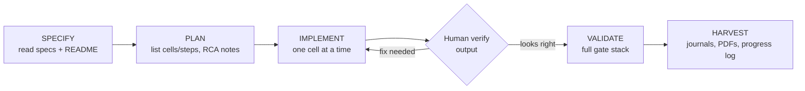

# ITAI 1371 — Lab 04: Exploratory Data Analysis

[](https://github.com/ClayClimate-AI/itai-1371-module-04-eda/actions/workflows/ci.yml)


Exploratory Data Analysis on the Titanic dataset, built with the spec-driven,
gate-checked workflow reused across this course's labs. Solo submission under
the group name **SingleEpoch**.

## Table of contents

- [Assignment at a glance](#assignment-at-a-glance)
- [Repository structure](#repository-structure)
- [Dataset](#dataset)
- [Getting started](#getting-started)
- [Workflow](#workflow)
- [Notebook structure](#notebook-structure)
- [Testing and CI](#testing-and-ci)
- [Root Cause Analysis (RCA) approach](#root-cause-analysis-rca-approach)
- [Deliverables](#deliverables)
- [Rubric mapping](#rubric-mapping)
- [Status](#status)
- [Course and academic context](#course-and-academic-context)

## Assignment at a glance

| | |
| --- | --- |
| **Course** | ITAI 1371 — Module 04, Working with Data and EDA |
| **Assignment** | Lab 04 — Exploratory Data Analysis (Titanic) |
| **Submission type** | Solo, independent contributor (group name `SingleEpoch`) |
| **Due** | Tuesday, 15 Sep 2026, 11:59 PM CT |
| **Definition of done** | [`specs/lab04_acceptance.md`](specs/lab04_acceptance.md) |
| **Points** | 100 (Project 70 / Reflection 10 / Individual contribution 20) |

> Canvas's assignment template still refers to "PeerGroupName" — this repo satisfies
> that field with `SingleEpoch`, the same group name used for this course's Module 3
> submission. See [`docs/Lab04_status_and_PIOF.md`](docs/Lab04_status_and_PIOF.md) for
> the full naming history.

## Repository structure

```text
itai-1371-module-04-eda
├── Module_04_Lab_Exploratory_Data_Analysis.ipynb   # main deliverable notebook
├── README.md
├── requirements.txt
├── checkpoints.md                                  # per-step done/not-done tracking
├── progress.md                                      # incremental work log
├── reflections.md                                    # journal draft (-> PDF)
├── HOW_TO_OPEN_IN_CURSOR.md
├── .github/
│   └── workflows/
│       └── ci.yml                                   # repo-level gate (push/PR)
├── assets/                                           # exported figures, images
├── docs/
│   ├── Reuse_from_Module03_plan.md                   # what carries over from Module 3
│   └── Lab04_status_and_PIOF.md                      # purpose/input/output/flow log
├── scripts/
│   └── setup_gate.py                                 # local environment gate
├── specs/
│   └── lab04_acceptance.md                           # definition of done
└── tests/
    └── test_imports.py
```

## Dataset

The notebook loads the Titanic passenger dataset directly from a URL at runtime —
no local dataset file is checked into this repository. Known data-quality issues
(handled via the [RCA approach](#root-cause-analysis-rca-approach) below) include
missing `Age`, largely missing `Cabin`, and a small number of missing `Embarked`
values.

## Getting started

```bash
git clone https://github.com/ClayClimate-AI/itai-1371-module-04-eda.git
cd itai-1371-module-04-eda

python -m venv .venv
source .venv/bin/activate      # Windows: .venv\Scripts\activate

pip install -r requirements.txt
python scripts/setup_gate.py   # confirms pandas/numpy/matplotlib/seaborn import cleanly

jupyter notebook Module_04_Lab_Exploratory_Data_Analysis.ipynb
```

Run the notebook top to bottom. Before exporting the final PDF, use
**Kernel → Restart & Run All** for a clean, in-order execution.

## Workflow

This lab follows the same builder loop as the rest of the course, documented in
full in [`CLAUDE.md`](CLAUDE.md):



**Build vs. verify split:** changes are made one notebook cell at a time; each one
is run and verified by the author before moving to the next. Restart & Run All is
the final clean-kernel proof, not a substitute for reviewing each output.

## Notebook structure

`Module_04_Lab_Exploratory_Data_Analysis.ipynb` — 20 cells (12 markdown, 8 code):

| Part | Cells | Type | Content |
| --- | --- | --- | --- |
| 1 | Setup and data loading | code (instructor) | imports, load Titanic data |
| 2 | Descriptive statistics | code (instructor) | `.describe()` summary |
| 3 | Visual EDA | code (instructor) | Survived, Pclass×Survived, Sex×Survived, Age FacetGrid |
| 4 | Student experimentation | **code (student)** | Embarked countplot; Fare boxplot/violinplot |
| — | Knowledge check | markdown | short-answer reflection questions |

The two student cells are completed by mirroring the instructor-filled seaborn
examples earlier in the notebook and swapping the column names — no model
training or new library usage is required for this lab.

## Testing and CI

Validation runs at two levels, mirrored intentionally so a grader (or a fresh
clone) sees the same result as the local environment:

```text
VALIDATE
├── Local   → scripts/setup_gate.py + pytest tests/
├── Repo    → .github/workflows/ci.yml runs the same two steps on push/PR
├── Per cell → stated intent (Purpose / Input / Output / Flow) before running
├── Human   → author reads each plot/table, pass or fail
└── Kernel  → Restart and Run All, last step, catches state drift only
```

```bash
python scripts/setup_gate.py
pytest tests/ -v
```

## Root Cause Analysis (RCA) approach

Wherever a data defect surfaces (missing values, outliers, an unexpected
category), the notebook's explanation cells and the reflective journal record it
as:

```text
Symptom  → what was observed (e.g. Age is null for ~20% of rows)
Cause    → likely reason (e.g. not collected for all passengers at boarding)
Fix      → decision made (e.g. left as NaN for EDA, or imputed for one plot)
Why      → justification for that fix over the alternatives
```

## Deliverables

| # | Deliverable | Filename |
| --- | --- | --- |
| 1 | Executed notebook (PDF) | `L04_SingleEpoch_ITAI1371.pdf` |
| 2 | Reflective journal, 1–2 pages | `L04Journal_R_SingleEpoch_ITAI1371.pdf` |
| 3 | Contribution journal, 1–2 pages | `L04Journal_C_SingleEpoch_ITAI1371.pdf` |

## Rubric mapping

| Rubric line | Weight | Where it's satisfied |
| --- | --- | --- |
| Project (working notebook + documentation) | 70 | Notebook cells 1–19, explanation markdown, RCA notes |
| Reflection | 10 | `L04Journal_R_SingleEpoch_ITAI1371.pdf` (from `reflections.md`) |
| Individual contribution | 20 | `L04Journal_C_SingleEpoch_ITAI1371.pdf` (solo-contributor wording) |

## Status

Live, incrementally-updated status lives in [`progress.md`](progress.md) and
[`checkpoints.md`](checkpoints.md) — updated as each step happens, not
summarized after the fact.

## Course and academic context

This is coursework for ITAI 1371 and is shared for transparency of process, not
as a template for direct reuse in a current offering of the course. The reusable
process (folder layout, gates, builder loop) is adapted from this author's Module
03 submission; the Titanic dataset, notebook, and acceptance criteria are
specific to Module 04 and are not derived from Module 03.
